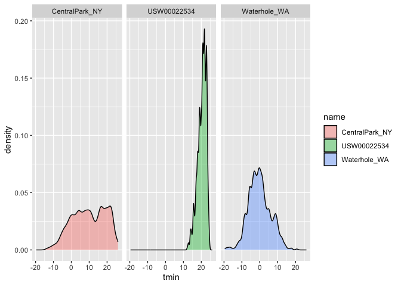
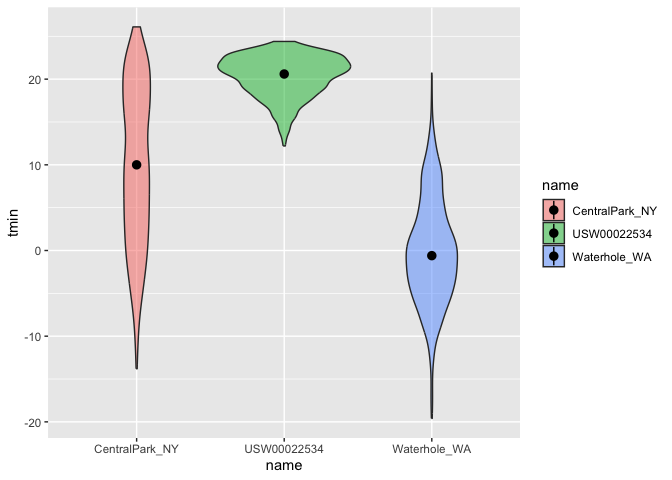
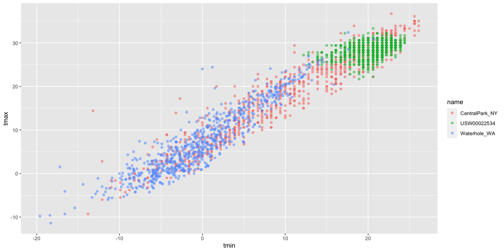

Visualization 1
================
Xiaoyu Wu
2023-09-27

``` r
library(tidyverse)
```

    ## ── Attaching core tidyverse packages ──────────────────────── tidyverse 2.0.0 ──
    ## ✔ dplyr     1.1.3     ✔ readr     2.1.4
    ## ✔ forcats   1.0.0     ✔ stringr   1.5.0
    ## ✔ ggplot2   3.4.3     ✔ tibble    3.2.1
    ## ✔ lubridate 1.9.2     ✔ tidyr     1.3.0
    ## ✔ purrr     1.0.2     
    ## ── Conflicts ────────────────────────────────────────── tidyverse_conflicts() ──
    ## ✖ dplyr::filter() masks stats::filter()
    ## ✖ dplyr::lag()    masks stats::lag()
    ## ℹ Use the conflicted package (<http://conflicted.r-lib.org/>) to force all conflicts to become errors

``` r
library(ggridges)
```

## R Markdown

``` r
weather_df = 
  rnoaa::meteo_pull_monitors(
    c("USW00094728", "USW00022534", "USS0023B17S"),
    var = c("PRCP", "TMIN", "TMAX"), 
    date_min = "2021-01-01",
    date_max = "2022-12-31") |>
  mutate(
    name = recode(
      id, 
      USW00094728 = "CentralPark_NY", 
      USC00519397 = "Molokai_HI",
      USS0023B17S = "Waterhole_WA"),
    tmin = tmin / 10,
    tmax = tmax / 10) |>
  select(name, id, everything())
```

    ## using cached file: /Users/wuxiaoyu/Library/Caches/org.R-project.R/R/rnoaa/noaa_ghcnd/USW00094728.dly

    ## date created (size, mb): 2023-09-27 13:57:30.794807 (8.524)

    ## file min/max dates: 1869-01-01 / 2023-09-30

    ## using cached file: /Users/wuxiaoyu/Library/Caches/org.R-project.R/R/rnoaa/noaa_ghcnd/USW00022534.dly

    ## date created (size, mb): 2023-09-27 13:57:46.651722 (3.83)

    ## file min/max dates: 1949-10-01 / 2023-09-30

    ## using cached file: /Users/wuxiaoyu/Library/Caches/org.R-project.R/R/rnoaa/noaa_ghcnd/USS0023B17S.dly

    ## date created (size, mb): 2023-09-27 13:57:51.612726 (0.994)

    ## file min/max dates: 1999-09-01 / 2023-09-30

``` r
weather_df
```

    ## # A tibble: 2,190 × 6
    ##    name           id          date        prcp  tmax  tmin
    ##    <chr>          <chr>       <date>     <dbl> <dbl> <dbl>
    ##  1 CentralPark_NY USW00094728 2021-01-01   157   4.4   0.6
    ##  2 CentralPark_NY USW00094728 2021-01-02    13  10.6   2.2
    ##  3 CentralPark_NY USW00094728 2021-01-03    56   3.3   1.1
    ##  4 CentralPark_NY USW00094728 2021-01-04     5   6.1   1.7
    ##  5 CentralPark_NY USW00094728 2021-01-05     0   5.6   2.2
    ##  6 CentralPark_NY USW00094728 2021-01-06     0   5     1.1
    ##  7 CentralPark_NY USW00094728 2021-01-07     0   5    -1  
    ##  8 CentralPark_NY USW00094728 2021-01-08     0   2.8  -2.7
    ##  9 CentralPark_NY USW00094728 2021-01-09     0   2.8  -4.3
    ## 10 CentralPark_NY USW00094728 2021-01-10     0   5    -1.6
    ## # ℹ 2,180 more rows

## Let’s make a plot!

Create my first scatterplot ever

``` r
ggplot(weather_df, aes(x = tmin, y = tmax)) + 
  geom_point()
```

    ## Warning: Removed 17 rows containing missing values (`geom_point()`).

<!-- --> New
approach, same plot, we do this way more often!

``` r
weather_df |>
  ggplot(aes(x = tmin, y = tmax)) + 
  geom_point()
```

    ## Warning: Removed 17 rows containing missing values (`geom_point()`).

<!-- --> Save
and edit a plot object

``` r
ggp_weather = 
  weather_df |>
  ggplot(aes(x = tmin, y = tmax)) 

ggp_weather + geom_point()
```

    ## Warning: Removed 17 rows containing missing values (`geom_point()`).

<!-- -->

``` r
# Save the output of ggplot() to an object and modify / print it later.
```

## Advanced scatterplot

``` r
weather_df |>
  ggplot(aes(x = tmin, y = tmax,color=name)) + 
  geom_point()
```

    ## Warning: Removed 17 rows containing missing values (`geom_point()`).

<!-- -->

``` r
# Incorporate using the color aesthetic.
```

``` r
weather_df |>
  ggplot(aes(x = tmin, y = tmax,color=name)) + 
# color applies to all lines below 
  geom_point() +
  geom_smooth(se = FALSE)
```

    ## `geom_smooth()` using method = 'loess' and formula = 'y ~ x'

    ## Warning: Removed 17 rows containing non-finite values (`stat_smooth()`).

    ## Warning: Removed 17 rows containing missing values (`geom_point()`).

<!-- -->

``` r
# Add a smooth curve
```

what about the `aes` placement

``` r
weather_df |>
  ggplot(aes(x = tmin, y = tmax)) + 
  geom_point(aes(color=name)) +
# color only applies to the scatterplot
  geom_smooth(se = FALSE)
```

    ## `geom_smooth()` using method = 'gam' and formula = 'y ~ s(x, bs = "cs")'

    ## Warning: Removed 17 rows containing non-finite values (`stat_smooth()`).

    ## Warning: Removed 17 rows containing missing values (`geom_point()`).

<!-- -->

``` r
# mostly we cannot define asthetics in the first step, we prefer to define in geom_point so that the color is not everywhere 
```

Let’s facet some things!

``` r
weather_df |>
  ggplot(aes(x = tmin, y = tmax,color=name)) + 
  geom_point(alpha = .3) +
# alpha makes individual points more transparent, 30% transparent and 70% solid.  
  geom_smooth(se = FALSE,size=2)+
# change the size of the smooth line 
  facet_grid(. ~ name)
```

    ## Warning: Using `size` aesthetic for lines was deprecated in ggplot2 3.4.0.
    ## ℹ Please use `linewidth` instead.
    ## This warning is displayed once every 8 hours.
    ## Call `lifecycle::last_lifecycle_warnings()` to see where this warning was
    ## generated.

    ## `geom_smooth()` using method = 'loess' and formula = 'y ~ x'

    ## Warning: Removed 17 rows containing non-finite values (`stat_smooth()`).

    ## Warning: Removed 17 rows containing missing values (`geom_point()`).

<!-- -->

``` r
# Add facet based on name and seperate on "y axis"
```

Let’s combine some elements and try a new plot.

``` r
weather_df |>
  ggplot(aes(x = date, y = tmax,color=name)) + 
  geom_point(aes(size=prcp),alpha = .3) +
  geom_smooth(se = FALSE)+
  facet_grid(. ~ name)
```

    ## `geom_smooth()` using method = 'loess' and formula = 'y ~ x'

    ## Warning: Removed 17 rows containing non-finite values (`stat_smooth()`).

    ## Warning: Removed 19 rows containing missing values (`geom_point()`).

<!-- -->

``` r
# Set x axis as date and show the precipitation on graph 
```

Try assigning specific color

``` r
weather_df |>
  filter(name=="CentralPark_NY") |>
  ggplot(aes(x = date, y = tmax)) + 
  geom_point(color="blue")
```

<!-- -->

Learning Assessment

``` r
weather_df |> 
  filter(name == "CentralPark_NY") |> 
  mutate(
    tmax_fahr = tmax * (9 / 5) + 32,
    tmin_fahr = tmin * (9 / 5) + 32) |> 
  ggplot(aes(x = tmin_fahr, y = tmax_fahr)) +
  geom_point(alpha = .5) + 
  geom_smooth(method = "lm", se = FALSE)
```

    ## `geom_smooth()` using formula = 'y ~ x'

<!-- -->

``` r
# Focuses only on Central Park, converts temperatures to Fahrenheit, makes a scatterplot of min vs. max temperature, and overlays a linear regression line (using options in geom_smooth(). 
```

## Some small notes

How many geoms have to exist? You can have whatever geoms you want. You
can use a neat geom!

``` r
weather_df |>
  ggplot(aes(x = tmin, y = tmax)) + 
  geom_hex() 
```

    ## Warning: Removed 17 rows containing non-finite values (`stat_binhex()`).

<!-- -->

``` r
# geom_bin2d()
# geom_density2d()
```

## Odds and Ends

``` r
ggplot(weather_df, aes(x = date, y = tmax, color = name)) + 
  geom_smooth(se = FALSE) 
```

    ## `geom_smooth()` using method = 'loess' and formula = 'y ~ x'

    ## Warning: Removed 17 rows containing non-finite values (`stat_smooth()`).

<!-- -->

``` r
ggplot(weather_df) + geom_point(aes(x = tmax, y = tmin), color = "blue")
```

    ## Warning: Removed 17 rows containing missing values (`geom_point()`).

<!-- -->

``` r
# Defining the color of the points by hand
```

``` r
ggplot(weather_df) + geom_point(aes(x = tmax, y = tmin, color = "blue"))
```

    ## Warning: Removed 17 rows containing missing values (`geom_point()`).

<!-- -->

``` r
# Creating a color variable that has the value blue everywhere; ggplot is then assigning colors according to this variable using the default color scheme.
```

## Univariate plots

Histograms are really great.

``` r
weather_df |> 
   ggplot(aes(x = tmin)) + 
  geom_histogram()
```

    ## `stat_bin()` using `bins = 30`. Pick better value with `binwidth`.

    ## Warning: Removed 17 rows containing non-finite values (`stat_bin()`).

<!-- -->

``` r
# histogram
```

Can we add color..

``` r
weather_df |> 
  ggplot(aes(x = tmin,color=name)) + 
  geom_histogram(position="dodge") 
```

    ## `stat_bin()` using `bins = 30`. Pick better value with `binwidth`.

    ## Warning: Removed 17 rows containing non-finite values (`stat_bin()`).

<!-- -->

``` r
# the bins sit next to each other 
```

Let’s try a new geometry!

``` r
weather_df |> 
  ggplot(aes(x = tmin,fill=name)) +
# fill only applies to density plot 
  geom_density(alpha = .4,adjust = .5) +
# adjust is about the same with binwidth 
  facet_grid(.~name)
```

    ## Warning: Removed 17 rows containing non-finite values (`stat_density()`).

<!-- -->

``` r
# Density plot
```

What about boxplots?

``` r
weather_df |> 
  ggplot(aes(x = name,y=tmax)) + 
  geom_boxplot()
```

    ## Warning: Removed 17 rows containing non-finite values (`stat_boxplot()`).

<!-- -->

``` r
# boxplot
```

Trendy plots :)

``` r
weather_df |> 
  ggplot(aes(x = name,y=tmin,fill=name)) + 
  geom_violin(alpha=0.5) + 
  stat_summary(fun="median")
```

    ## Warning: Removed 17 rows containing non-finite values (`stat_ydensity()`).

    ## Warning: Removed 17 rows containing non-finite values (`stat_summary()`).

    ## Warning: Removed 3 rows containing missing values (`geom_segment()`).

<!-- -->

``` r
# violin plots
```

Ridge plots

``` r
weather_df |> 
  ggplot(aes(x = tmin,y=name)) + 
  geom_density_ridges() 
```

    ## Picking joint bandwidth of 1.41

    ## Warning: Removed 17 rows containing non-finite values
    ## (`stat_density_ridges()`).

<!-- -->

``` r
# ridge plots
```

## Save and Export

``` r
weather_plot =
  weather_df |> 
  ggplot(aes(x = tmin, y = tmax,color=name)) + 
  geom_point(alpha = .5) 

ggsave("weather_plot.pdf", weather_plot, width = 8, height = 5)
```

    ## Warning: Removed 17 rows containing missing values (`geom_point()`).

What about emdedding?

``` r
weather_plot
```

    ## Warning: Removed 17 rows containing missing values (`geom_point()`).

<!-- -->

``` r
# embed figures in r-markdown document 
```

Embed at different size.

``` r
weather_plot
```

    ## Warning: Removed 17 rows containing missing values (`geom_point()`).

<!-- -->

``` r
# embed figures in r-markdown document 
```
