Visualization 2
================
Xiaoyu Wu
2023-09-29

``` r
library(tidyverse)
```

    ## ── Attaching core tidyverse packages ──────────────────────── tidyverse 2.0.0 ──
    ## ✔ dplyr     1.1.3     ✔ readr     2.1.4
    ## ✔ forcats   1.0.0     ✔ stringr   1.5.0
    ## ✔ ggplot2   3.4.3     ✔ tibble    3.2.1
    ## ✔ lubridate 1.9.2     ✔ tidyr     1.3.0
    ## ✔ purrr     1.0.2     
    ## ── Conflicts ────────────────────────────────────────── tidyverse_conflicts() ──
    ## ✖ dplyr::filter() masks stats::filter()
    ## ✖ dplyr::lag()    masks stats::lag()
    ## ℹ Use the conflicted package (<http://conflicted.r-lib.org/>) to force all conflicts to become errors

``` r
library(patchwork)
```

Load Dataset

``` r
weather_df = 
  rnoaa::meteo_pull_monitors(
    c("USW00094728", "USC00519397", "USS0023B17S"),
    var = c("PRCP", "TMIN", "TMAX"), 
    date_min = "2017-01-01",
    date_max = "2017-12-31") %>%
  mutate(
    name = recode(
      id, 
      USW00094728 = "CentralPark_NY", 
      USC00519397 = "Waikiki_HA",
      USS0023B17S = "Waterhole_WA"),
    tmin = tmin / 10,
    tmax = tmax / 10) %>%
  select(name, id, everything())
```

    ## using cached file: /Users/wuxiaoyu/Library/Caches/org.R-project.R/R/rnoaa/noaa_ghcnd/USW00094728.dly

    ## date created (size, mb): 2023-09-27 13:57:30.794807 (8.524)

    ## file min/max dates: 1869-01-01 / 2023-09-30

    ## using cached file: /Users/wuxiaoyu/Library/Caches/org.R-project.R/R/rnoaa/noaa_ghcnd/USC00519397.dly

    ## date created (size, mb): 2023-09-29 11:56:17.087775 (1.707)

    ## file min/max dates: 1965-01-01 / 2023-09-30

    ## using cached file: /Users/wuxiaoyu/Library/Caches/org.R-project.R/R/rnoaa/noaa_ghcnd/USS0023B17S.dly

    ## date created (size, mb): 2023-09-27 13:57:51.612726 (0.994)

    ## file min/max dates: 1999-09-01 / 2023-09-30

``` r
weather_df
```

    ## # A tibble: 1,095 × 6
    ##    name           id          date        prcp  tmax  tmin
    ##    <chr>          <chr>       <date>     <dbl> <dbl> <dbl>
    ##  1 CentralPark_NY USW00094728 2017-01-01     0   8.9   4.4
    ##  2 CentralPark_NY USW00094728 2017-01-02    53   5     2.8
    ##  3 CentralPark_NY USW00094728 2017-01-03   147   6.1   3.9
    ##  4 CentralPark_NY USW00094728 2017-01-04     0  11.1   1.1
    ##  5 CentralPark_NY USW00094728 2017-01-05     0   1.1  -2.7
    ##  6 CentralPark_NY USW00094728 2017-01-06    13   0.6  -3.8
    ##  7 CentralPark_NY USW00094728 2017-01-07    81  -3.2  -6.6
    ##  8 CentralPark_NY USW00094728 2017-01-08     0  -3.8  -8.8
    ##  9 CentralPark_NY USW00094728 2017-01-09     0  -4.9  -9.9
    ## 10 CentralPark_NY USW00094728 2017-01-10     0   7.8  -6  
    ## # ℹ 1,085 more rows

## Remember this plot…?

``` r
weather_df %>% 
  ggplot(aes(x = tmin, y = tmax, color=name)) + 
  geom_point( alpha = .5)
```

    ## Warning: Removed 15 rows containing missing values (`geom_point()`).

<!-- --> \##
Add labels

``` r
weather_df %>% 
  ggplot(aes(x = tmin, y = tmax, color=name)) + 
  geom_point( alpha = .5) + 
  labs(
    title = "Temperature plot",
# specify the title 
    x = "Minimum daily temperature (C)",
# specify the x axis label  
    y = "Maxiumum daily temperature (C)",
# specify the y axis label 
    caption = "Data from the rnoaa package; temperatures in 2017"
  )
```

    ## Warning: Removed 15 rows containing missing values (`geom_point()`).

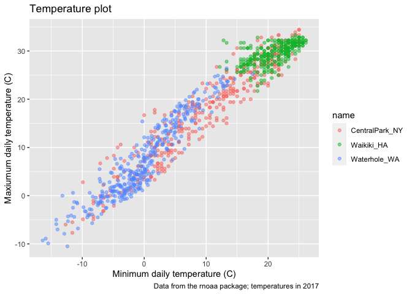<!-- -->

``` r
# add a caption 
```

## Scales

Start with the same plot; x and y scales.

``` r
weather_df %>% 
  ggplot(aes(x = tmin, y = tmax)) + 
  geom_point(aes(color = name), alpha = .5) + 
  labs(
    title = "Temperature plot",
    x = "Minimum daily temperature (C)",
    y = "Maxiumum daily temperature (C)",
    caption = "Data from the rnoaa package; temperatures in 2017") + 
  scale_x_continuous(
    breaks = c(-15, 0, 15), 
    labels = c("-15º C", "0", "15")) +
# scale label 
# categorical or factor variable we use scale_x_discrete 
    scale_y_continuous(
    trans = "sqrt", 
# scale_y_sqrt() can be added to a ggplot object to transform the Y scale
  # OR trans="log"
    limits=c(0,30),
    position = "right")
```

    ## Warning in self$trans$transform(x): NaNs produced

    ## Warning: Transformation introduced infinite values in continuous y-axis

    ## Warning: Removed 283 rows containing missing values (`geom_point()`).

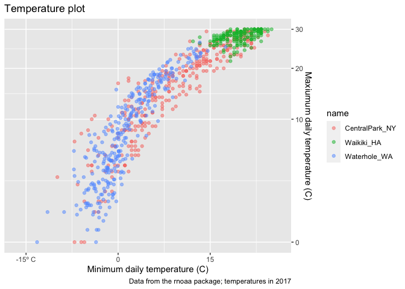<!-- -->

``` r
# change the scale position to the right 
```

Look at color scales

``` r
weather_df %>% 
  ggplot(aes(x = tmin, y = tmax,color=name)) + 
  geom_point(aes(color = name), alpha = .5) + 
  labs(
    title = "Temperature plot",
    x = "Minimum daily temperature (C)",
    y = "Maxiumum daily temperature (C)",
    caption = "Data from the rnoaa package; temperatures in 2017") + 
    scale_color_hue(
      name = "Location", 
# change the title of the caption from "name" to "location" 
      h = c(100, 300))
```

    ## Warning: Removed 15 rows containing missing values (`geom_point()`).

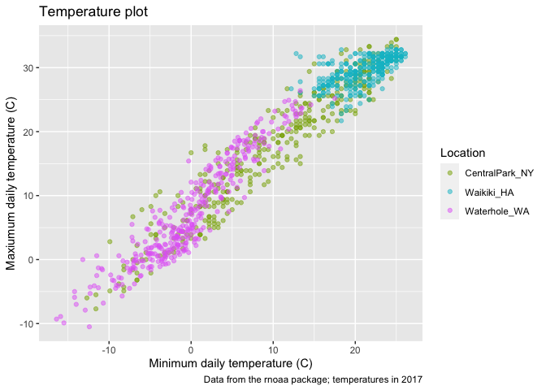<!-- -->

``` r
# arguments to scale_color_hue() control the color scale 
```

OR

``` r
weather_df %>% 
  ggplot(aes(x = tmin, y = tmax,color=name)) + 
  geom_point(aes(color = name), alpha = .5) + 
  labs(
    title = "Temperature plot",
    x = "Minimum daily temperature (C)",
    y = "Maxiumum daily temperature (C)",
    caption = "Data from the rnoaa package; temperatures in 2017") + 
    viridis::scale_color_viridis(
      name = "Location",
      discrete=TRUE)
```

    ## Warning: Removed 15 rows containing missing values (`geom_point()`).

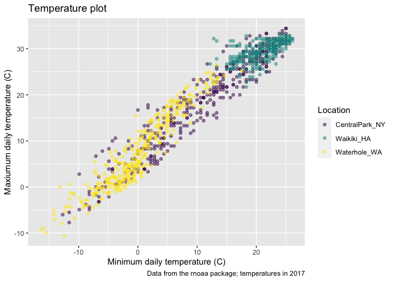<!-- -->

``` r
# viridis::scale_color_viridis assume the scale is continuous, we have to tell it's discrete by "name"
```

Themes

Shift the legend

``` r
weather_df %>% 
  ggplot(aes(x = tmin, y = tmax,color=name)) + 
  geom_point(aes(color = name), alpha = .5) + 
  labs(
    title = "Temperature plot",
    x = "Minimum daily temperature (C)",
    y = "Maxiumum daily temperature (C)",
    caption = "Data from the rnoaa package; temperatures in 2017") + 
    viridis::scale_color_viridis(
      name = "Location",
      discrete=TRUE) + 
  theme(legend.position = "bottom")
```

    ## Warning: Removed 15 rows containing missing values (`geom_point()`).

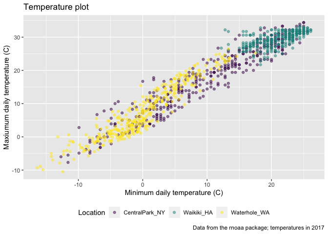<!-- -->

``` r
# change the position of legend to bottom 
```

theme built in

``` r
weather_df %>% 
  ggplot(aes(x = tmin, y = tmax,color=name)) + 
  geom_point(aes(color = name), alpha = .5) + 
  labs(
    title = "Temperature plot",
    x = "Minimum daily temperature (C)",
    y = "Maxiumum daily temperature (C)",
    caption = "Data from the rnoaa package; temperatures in 2017") + 
    viridis::scale_color_viridis(
      name = "Location",
      discrete=TRUE) + 
      theme_bw()+
      theme(legend.position="bottom")
```

    ## Warning: Removed 15 rows containing missing values (`geom_point()`).

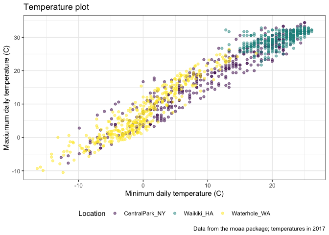<!-- -->

``` r
# theme black and white
# theme_minimal() 
# theme_classic()
# ggthemes::theme_economist()
# ggthemes::theme_excel()
```

learning assessment

``` r
ggplot(weather_df, aes(x = date, y = tmax, color = name)) + 
  geom_smooth(se = FALSE) + 
  geom_point(aes(size = prcp), alpha = .75) + 
  labs(
    title = "Temperature plot",
    x = "Date",
    y = "Maxiumum daily temperature (C)",
    caption = "Data from the rnoaa package"
  ) + 
  viridis::scale_color_viridis(discrete = TRUE) + 
  theme_minimal() + 
  theme(legend.position = "bottom")
```

    ## `geom_smooth()` using method = 'loess' and formula = 'y ~ x'

    ## Warning: Removed 3 rows containing non-finite values (`stat_smooth()`).

    ## Warning: Removed 3 rows containing missing values (`geom_point()`).

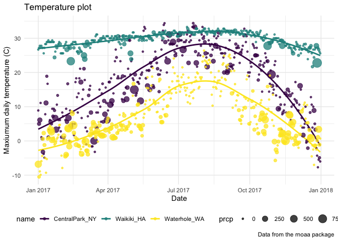<!-- -->

## Setting options on the very beginning of rmarkdown document

``` r
library(tidyverse)

knitr::opts_chunk$set(
  fig.width=6,
  fig.asp= .6,
  out.width="90%"
)

theme_set(theme_minimal()+theme(legend.position="bottom"))

options(
  ggplot2.cotinuous.color="viridis",
  ggplot2.cotinuous.fill="viridis"
)
# overwrite ggplot default coloring and take care of call the colors and fills 

scale_color_discrete=scale_color_viridis_d
scale_fill_discrete=scale_fill_viridis_d
```

## data argument in `geom`

``` r
central_park = 
  weather_df %>% 
  filter(name == "CentralPark_NY")
waikiki = 
  weather_df %>% 
  filter(name == "Waikiki_HA")
# split weather_df into separate datasets for Central Park and Waikiki
ggplot(data = waikiki, aes(x = date, y = tmax, color = name)) + 
  geom_point() + 
  geom_line(data = central_park)
```

    ## Warning: Removed 3 rows containing missing values (`geom_point()`).

<!-- -->

``` r
# use one in the ggplot() call and another in geom_line()
```

## patchwork

remember faceting?

``` r
weather_df |> 
  ggplot(aes(x = tmin,fill=name)) +
# fill only applies to density plot 
  geom_density(alpha = .5) +
# adjust is about the same with binwidth 
  facet_grid(.~name)
```

    ## Warning: Removed 15 rows containing non-finite values (`stat_density()`).

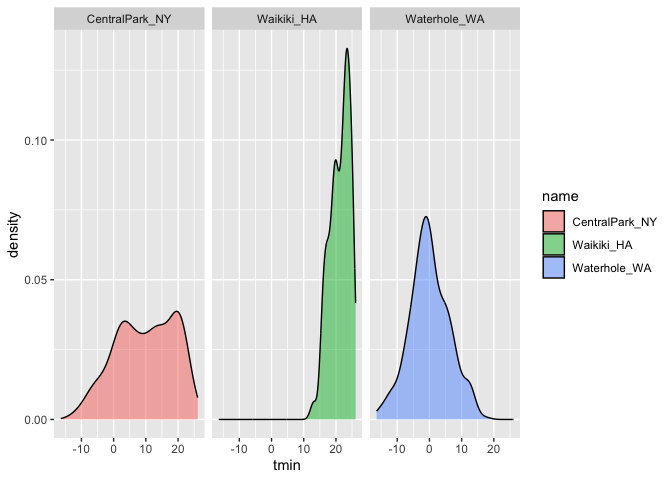<!-- -->

``` r
tmax_tmin_p = 
  weather_df %>% 
  ggplot(aes(x = tmax, y = tmin, color = name)) + 
  geom_point(alpha = .5) +
  theme(legend.position = "none")

prcp_dens_p = 
  weather_df %>% 
  filter(prcp > 0) %>% 
  ggplot(aes(x = prcp, fill = name)) + 
  geom_density(alpha = .5) + 
  theme(legend.position = "none")

tmax_date_p = 
  weather_df %>% 
  ggplot(aes(x = date, y = tmax, color = name)) + 
  geom_point(alpha = .5) +
  geom_smooth(se = FALSE) + 
  theme(legend.position = "bottom")

(tmax_tmin_p + prcp_dens_p) / tmax_date_p
```

    ## Warning: Removed 15 rows containing missing values (`geom_point()`).

    ## `geom_smooth()` using method = 'loess' and formula = 'y ~ x'

    ## Warning: Removed 3 rows containing non-finite values (`stat_smooth()`).

    ## Warning: Removed 3 rows containing missing values (`geom_point()`).

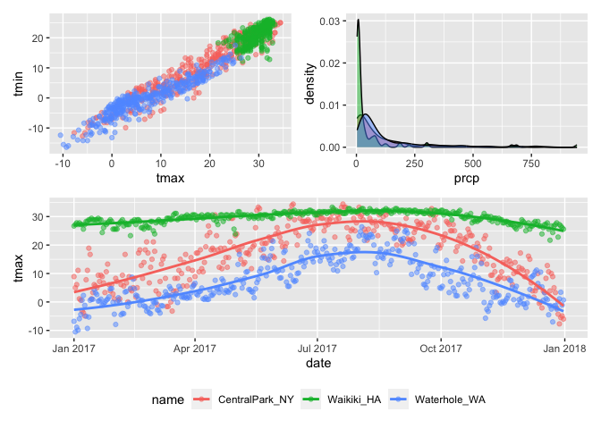<!-- --> \##
data manipulation

Control your factors.

``` r
weather_df  %>%
  mutate(
    name=factor(name),
  # character to fatcor version of name
    name=forcats::fct_relevel(name,c("Waikiki_HA"))
  ) %>%
# change the order of name 
  ggplot(aes(x=name,y=tmax,fill=name)) +
  geom_violin(alpha=.5)
```

    ## Warning: Removed 3 rows containing non-finite values (`stat_ydensity()`).

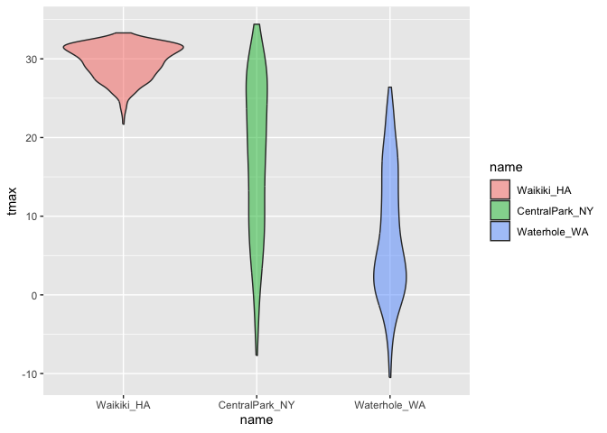<!-- -->

What if I wanted densities for tmin and tmax simultaneouly?

``` r
weather_df  %>%
  filter(name=="CentralPark_NY") %>%
  pivot_longer(
    tmax:tmin,
    names_to="observations",
    values_to="temperatures"
  ) %>%
  ggplot(aes(x=temperatures,fill=observations))+
  geom_density(alpha=.5)
```

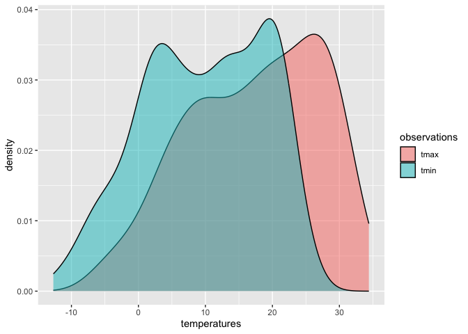<!-- -->

## Revisit the pups

Data from the FAS study.

``` r
pup_data=
  read_csv("./data/FAS_pups.csv") %>%
  janitor::clean_names() %>%
  mutate(sex=recode(sex,`1`="male",`2`="female"))
```

    ## Rows: 313 Columns: 6
    ## ── Column specification ────────────────────────────────────────────────────────
    ## Delimiter: ","
    ## chr (1): Litter Number
    ## dbl (5): Sex, PD ears, PD eyes, PD pivot, PD walk
    ## 
    ## ℹ Use `spec()` to retrieve the full column specification for this data.
    ## ℹ Specify the column types or set `show_col_types = FALSE` to quiet this message.

``` r
litters_data=
  read_csv("./data/FAS_litters.csv") %>%
  janitor::clean_names() %>%
  separate(group,into=c("dose","day_of_tx"),sep=3)
```

    ## Rows: 49 Columns: 8
    ## ── Column specification ────────────────────────────────────────────────────────
    ## Delimiter: ","
    ## chr (2): Group, Litter Number
    ## dbl (6): GD0 weight, GD18 weight, GD of Birth, Pups born alive, Pups dead @ ...
    ## 
    ## ℹ Use `spec()` to retrieve the full column specification for this data.
    ## ℹ Specify the column types or set `show_col_types = FALSE` to quiet this message.

``` r
fas_data=left_join(pup_data,litters_data,by="litter_number")

fas_data %>%
  select(dose,day_of_tx,starts_with("pd_")) %>%
  pivot_longer(
    pd_ears:pd_walk,
    names_to="outcome",
    values_to="pn_day"
  )  %>%
  drop_na() %>%
  mutate(outcome=forcats::fct_relevel(outcome,"pn_ears","pn_pivot","pn_walk","pn_eyes")) %>%
# factor manipulation 
  ggplot(aes(x=dose,y=pn_day))+
  geom_violin()+
  facet_grid(day_of_tx~outcome)
```

    ## Warning: There was 1 warning in `mutate()`.
    ## ℹ In argument: `outcome = forcats::fct_relevel(...)`.
    ## Caused by warning:
    ## ! 4 unknown levels in `f`: pn_ears, pn_pivot, pn_walk, and pn_eyes

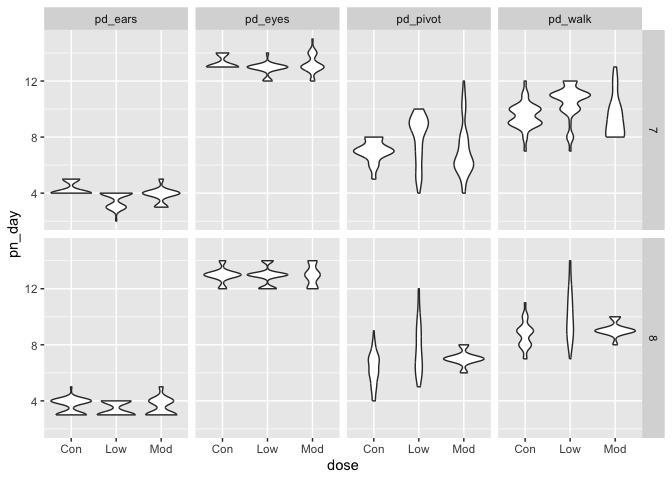<!-- -->

``` r
weather_df %>%
  mutate(name = forcats::fct_reorder(name, tmax)) %>% 
  ggplot(aes(x = name, y = tmax)) + 
  geom_violin(aes(fill = name), color = "blue", alpha = .5) + 
  theme(legend.position = "bottom")
```

    ## Warning: There was 1 warning in `mutate()`.
    ## ℹ In argument: `name = forcats::fct_reorder(name, tmax)`.
    ## Caused by warning:
    ## ! `fct_reorder()` removing 3 missing values.
    ## ℹ Use `.na_rm = TRUE` to silence this message.
    ## ℹ Use `.na_rm = FALSE` to preserve NAs.

    ## Warning: Removed 3 rows containing non-finite values (`stat_ydensity()`).

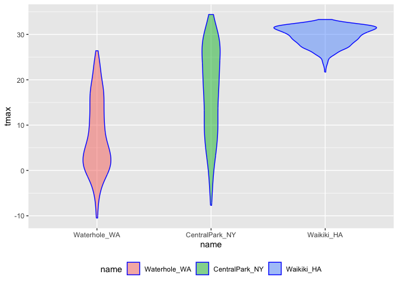<!-- -->

``` r
# reorders name according to tmax values in each name
```
